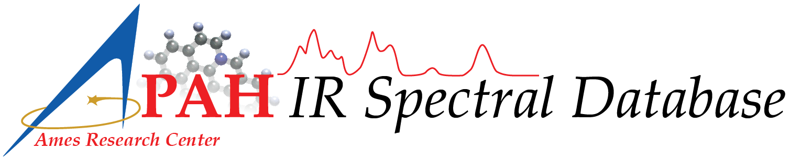

`NASA <https://www.nasa.gov>`_: `Ames Research Center <https://www.nasa.gov/ames>`_: `The Astrophysics & Astrochemistry Laboratory <https://astrochemistry.org/>`_

Pypahdb Manual
=======================

The NASA Ames PAH IR Spectroscopic Database [#f1]_ [#f2]_ (PAHdb)
hosts the world's foremost collection of infrared (IR) PAH
spectra. PAHdb's spectral libraries contain over 4,000 laboratory
measured and quantum chemically computed PAH spectra. Beyond
spectroscopic data, PAHdb also provides the models and software tools to work
with the spectral data. The portal to the data and tools is the PAHdb
website, which is located at `https://www.astrochemistry.org/pahdb
<https://www.astrochemistry.org/pahdb>`_.

The pypahdb Python package is being developed as part of the awarded
`James Webb Space Telescope <https://www.jwst.nasa.gov/>`_ (*JWST*)
Early Release Science (ERS) program "Radiative Feedback from Massive
Stars as Traced by Multiband Imaging and Spectroscopic Mosaics"
(`program website <http://pdrs4all.org/>`_; ID: 1288). The program is
coordinated by an international "Core team" of 19 scientists and
supported by 119 "science collaborators". Pypahdb is developed by the
`NASA Ames PAH IR Spectroscopic Database
<https://www.astrochemistry.org/pahdb/>`_ team, asscociated with the
`Astrophysics & Astrochemistry Laboratory
<https://www.astrochemistry.org>`_ at `NASA Ames Research Center
<https://www.nasa.gov/centers/ames>`_.

Please consult the `website <https://www.astrochemistry.org/pahdb/>`_ for
additional resources and information, and the PAHdb `cookbook
<https://pahdb.github.io/cookbook>`_ for general usage and examples.

Issues, comments, and suggestions can be submitted through
`https://github.com/PAHdb/pyPAHdb <https://github.com/PAHdb/pyPAHdb?/>`_.

.. toctree::
   :maxdepth: 1
   :hidden:

   background
   design
   installation
   usage
   pypahdb
   release-history

---------

*Last updated March 2023*

.. rubric:: Footnotes

.. [#f1] From FY2019-2022 the NASA Ames PAH IR Spectroscopic Database was
         supported through a directed Work Package at NASA Ames
         titled: "Laboratory Astrophysics ⸺ The NASA Ames PAH IR
         Spectroscopic Database."

.. [#f2] Since FY2022 the NASA Ames PAH IR Spectroscopic Database is being
         supported through the Laboratory Astrophysics Round 2 directed
         Work Package at NASA Ames.
