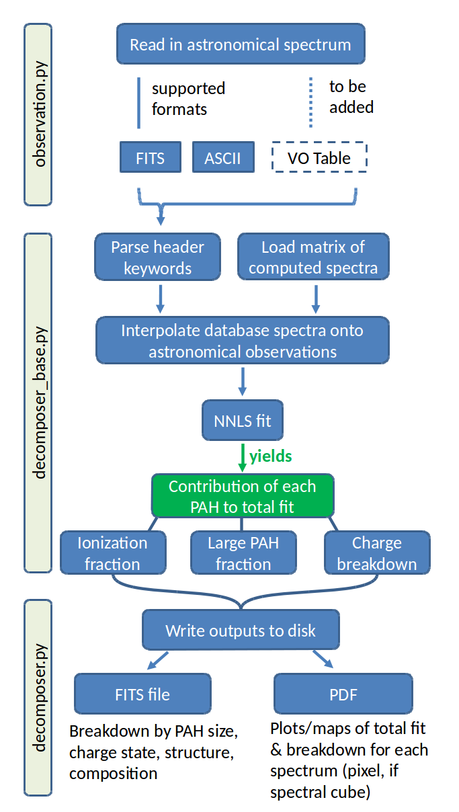

Introduction
============

The pypahdb Python package is being developed as part of the awarded
`James Webb Space Telescope <https://www.jwst.nasa.gov/>`_ (*JWST*)
Early Release Science (ERS) program "Radiative Feedback from Massive
Stars as Traced by Multiband Imaging and Spectroscopic Mosaics"
(`program website <http://jwst-ism.org/>`_; ID: 1288). The program is
coordinated by an international "Core team" of 19 scientists and
supported by 119 "science collaborators". pypahdb is developed by the
`NASA Ames PAH IR Spectroscopic Database
<https://www.astrochemistry.org/pahdb/>`_ team, asscociated with the
`Astrophysics & Astrochemistry Laboratory
<https://www.astrochemistry.org>`_ at `NASA Ames Research Center
<https://www.nasa.gov/centers/ames>`_.

The NASA Ames PAH IR Spectroscopic Database and pypahdb are being
supported through a directed Work Package at NASA Ames titled:
*"Laboratory Astrophysics – The NASA Ames PAH IR Spectroscopic
Database"*.

pypahdb is used to characterize emission from one of the most
prevalent types of organic molecules in space, namely polycyclic
aromatic hydrocarbons (PAHs). It leverages the detailed studies of
organic molecules done at the NASA Ames Research Center. pypahdb is a
streamlined Python version of the NASA Ames PAH IR Spectroscopic
Database's (PAHdb; `www.astrochemistry.org/pahdb
<https://www.astrochemistry.org/pahdb>`_) suite of IDL tools. PAHdb has
been extensively used to analyze and interpret the PAH signature from
a plethora of emission sources, ranging from solar-system objects to
entire galaxies. pypahdb decomposes astronomical PAH emission spectra
into contributing PAH sub-classes in terms of charge and size using a
database-fitting technique. The inputs for the fit are spectra
constructed using the spectroscopic libraries of PAHdb and take into
account the detailed photo-physics of the PAH excitation/emission
process.

Academic references
-------------------

You are kindly asked to consider the following references for citation
when using pypahdb:

  Shannon, M.J., Boersma, C., "ORGANIC MOLECULES IN SPACE: INSIGHTS
  FROM THE NASA AMES MOLECULAR DATABASE IN THE ERA OF THE JAMES WEBB
  SPACE TELESCOPE", 2018, *SciPy*, 99
  `https://doi.org/10.25080/majora-4af1f417-00f
  <https://dx.doi.org/10.25080/majora-4af1f417-00f>`__ — `BibTeX
  <https://www.astrochemistry.org/pahdb/theoretical/3.00/data/reference/10.25080~majora-4af1f417-00f/bibtex>`__ -
  `RIS
  <https://www.astrochemistry.org/pahdb/theoretical/3.00/data/reference/10.25080~majora-4af1f417-00f/ris>`__

  C.W. Bauschlicher, Jr., A. Ricca, C. Boersma, L.J. Allamandola, "THE
  NASA AMES PAH IR SPECTROSCOPIC DATABASE: COMPUTATIONAL VERSION 3.00
  WITH UPDATED CONTENT AND THE INTRODUCTION OF MULTIPLE SCALING
  FACTORS", *The Astrophysical Journal Supplement Series*, **234**,
  32, 2018, `https://doi.org/10.3847/1538-4365/aaa019
  <https://dx.doi.org/10.3847/1538-4365/aaa019>`__ — `BibTeX
  <https://www.astrochemistry.org/pahdb/theoretical/3.00/data/reference/10.3847~1538-4365~aaa019/bibtex>`__ -
  `RIS
  <https://www.astrochemistry.org/pahdb/theoretical/3.00/data/reference/10.3847~1538-4365~aaa019/ris>`__

  C. Boersma, C.W. Bauschlicher, Jr., A. Ricca,
  A.L. Mattioda, J. Cami, E. Peeters, F. S&#225;nchez de
  Armas, G. Puerta Saborido, D.M. Hudgins, and L.J. Allamandola, "THE
  NASA AMES PAH IR SPECTROSCOPIC DATABASE VERSION 2.00: UPDATED
  CONTENT, WEBSITE AND ON/OFFLINE TOOLS", *The Astrophysical Journal
  Supplement Series*, **211**, 8, 2014,
  `https://doi.org/10.1088/0067-0049/211/1/8
  <https://dx.doi.org/10.1088/0067-0049/211/1/8>`__ — `BibTeX
  <https://www.astrochemistry.org/pahdb/theoretical/3.00/data/reference/10.1088~0067-0049~211~1~8/bibtex>`__
  - `RIS <https://www.astrochemistry.org/pahdb/theoretical/3.00/data/reference/10.1088~0067-0049~211~1~8/ris>`__

  C.W. Bauschlicher, Jr., C. Boersma, A. Ricca,
  A.L. Mattioda, J. Cami, E. Peeters, F. S&#225;nchez de
  Armas, G. Puerta Saborido, D.M. Hudgins, and L.J. Allamandola, "THE
  NASA AMES PAH IR SPECTROSCOPIC DATABASE: THE COMPUTED SPECTRA", *The
  Astrophysical Journal Supplement Series*, **189**, 341, 2010,
  `https://doi.org/10.1088/0067-0049/189/2/341
  <http://dx.doi.org/10.1088/0067-0049/189/2/341>`__ — `BibTeX
  <https://www.astrochemistry.org/pahdb/theoretical/3.00/data/reference/10.1088~0067-0049~189~2~341/bibtex>`__ -
  `RIS
  <https://www.astrochemistry.org/pahdb/theoretical/3.00/data/reference/10.1088~0067-0049~189~2~341/ris>`__

  Mattioda, A. L., Hudgins, D. M., Boersma, C., Ricca, A., Peeters,
  E., Cami, J., S&#225;nchez de Armas, F., Puerta Saborido, G.,
  Bauschlicher, C. W., J., and Allamandola, L. J. "THE NASA AMES PAH
  IR SPECTROSCOPIC DATABASE: THE LABORATORY SPECTRA", *The
  Astrophysical Journal Supplement Series*, **XXX**, 201X *(in
  preparation)*

pypahdb background
------------------

The purpose of pyPAHdb is to derive astronomical parameters directly
from *JWST* observations, but the tool is not limited to *JWST*
observations alone. pypahdb is the light version of a full suite of
Python software tools\ [#]_ that is currently being developed, which
is an analog of the off-line IDL tools\ [#]_. A feature comparison is
presented in the table below. pyPAHdb will enable PAH experts and
non-experts alike to analyze and interpret astronomical PAH emission
spectra.

.. [#] *AmesPAHdbPythonSuite*: `github.com/PAHdb/AmesPAHdbPythonSuite
       <https://github.com/PAHdb/AmesPAHdbPythonSuite>`_

.. [#] *AmesPAHdbIDLSuite*: `github.com/PAHdb/AmesPAHdbIDLSuite
       <https://github.com/PAHdb/AmesPAHdbIDLSuite>`_

.. raw:: latex

   \setlength{\tablewidth}{0.7\textwidth}

.. table:: Feature comparison between pyPAHdb and the full suites of
           off-line IDL/Python tools. Note: NNLS stands for
           non-negative least squares; FWHM for full-width at
           half-maximum of an emission profile; "uncertainties" in
           this context refers to handling observational spectroscopic
           uncertainties.

   +---------------------+----------+------------------+
   |                     | pyPAHdb  | IDL/Python tools |
   +=====================+==========+==================+
   | Included molecules. | Fixed    | User defined     |
   +---------------------+----------+------------------+
   | Excitation energy   | Fixed    | User defined     |
   +---------------------+----------+------------------+
   | Emission profile    | Fixed    | Selectable       |
   +---------------------+----------+------------------+
   | FWHM                | Fixed    | User defined     |
   +---------------------+----------+------------------+
   | Band redshift       | Fixed    | User defined     |
   +---------------------+----------+------------------+
   | Emission model      | Fixed    | Selectable       |
   +---------------------+----------+------------------+
   | NNLS                | ✓        | ✓                |
   +---------------------+----------+------------------+
   | Class breakdown     | ✓        | ✓                |
   +---------------------+----------+------------------+
   | Parallelization     | ✓        | ✓                |
   +---------------------+----------+------------------+
   | Handle uncertainties|          | ✓                |
   +---------------------+----------+------------------+

pypahdb analyzes spectroscopic observations (including spectral maps)
and characterizes the PAH emission using a database-fitting approach,
providing the PAH ionization and size fractions.

The package is imported with the following statement:

.. code-block:: python

    import pypahdb

   pypahdb flowchart. (1) Astronomical spectroscopic data is loaded,
   whether loaded rom FITS or ASCII files. (2) An over-sampled
   pre-computed matrix of PAH spectra is loaded and interpolated onto
   the wavelength grid of the astronomical
   observations. Database-fitting is performed using non-negative
   least-squares (NNLS), which yields the contribution of an
   individual PAH molecule to the total fit. As a result, we obtain a
   breakdown of the model fit in terms of PAH charge and size. (3) The
   results are written to disk as a single FITS file and as a PDF
   summarizing the results (one page per pixel, if a spectral cube is
   provided as input).

The general program methodology is encapsulated in the flowchart
presented in the figure above and is as follows:

(1) Read-in a file containing spectroscopic PAH observations of an
    astronomical object. This functionality is provided by the class
    ``Observation``, which is implemented in ``observation.py``. It is
    the responsibility of the user to ensure all non-PAH emission
    components have been removed from the spectrum. The class uses a
    fall-through try-except chain to attempt to read the given
    filename using the facilities provided by ``astropy.io``. The
    spectroscopic data is stored as a ``specutils.Spectrum1D``
    object. The ``Spectrum1D`` class provides functionality to convert
    between different coordinate representations. Below is example
    Python code demonstrating the use of the class. The file
    ``sample_data_NGC7023.tbl`` in this demonstration can be
    found in the ``examples`` directory that is part of the pyPAHdb
    package. The output of the following code-block is shown in the
    flowchart.

.. code-block:: python

    import matplotlib.pyplot as plt
    from pypahdb.observation import Observation

    filename = 'sample_data_NGC7023.tbl'
    obs = Observation(filename)
    s = obs.spectrum
    plt.plot(s.spectral_axis, s.flux,0,0,:])
    plt.show()

(2) Decompose the observed PAH emission into contributions from
    different PAH subclasses, here charge and size. This functionality
    is provided by the class ``Decomposer``, which is implemented in
    ``decomposer.py``. The class takes as input a ``Spectrum1D`` object,
    of which it creates a deep copy and calls the
    ``Unit.to` method to convert the abscissa units
    to wavenumber. Subsequently, a pre-computed ``numpy`` matrix of
    highly oversampled PAH emission spectra stored as a ``pickle`` is
    loaded from file. Utilizing ``numpy.interp``, each of the PAH
    emission spectra, represented by a single column in the
    pre-computed matrix, is interpolated onto the frequency grid (in
    wavenumber) of the input spectrum. This process is parallelized
    using the ``multiprocessing`` package. ``optimize.nnls`` is used
    to perform a non-negative least-squares (NNLS) fit of the
    pre-computed spectra to the input spectra. NNLS is chosen because
    it is appropriate to the problem, fast, and always converges. The
    solution vector (weights) is stored as an attribute and considered
    private. Combining lazy instantiation and Python's @property, the
    results of the fit and the breakdown can be retrieved. In case the
    input spectrum represents a spectral cube and where possible, the
    calculations are parallelized across each pixel using, again, the
    ``multiprocessing`` package. Below is example code demonstrating
    the use of the class and extends the previous code-block. The
    output of the code-block is shown in the flowchart.

.. code-block:: python

    from pypahdb.decomposer import Decomposer

    result = Decomposer(obs.spectrum)
    s = result.spectrum
    plt.plot(s.spectral_axis, s.flux[0,0,:], 'x')
    plt.plot(s.spectral_axis, result.fit[:,0,0])
    plt.show()

(3) Produce output to file given a ``Decomposer`` object. Previously
    stored within the ``Writer`` class, this functionality is now
    contained within ``Decomposer`` itself. The output serves to
    summarize the results from the ``Decomposer`` class so that a user
    may assess the quality of the fit and store the PAH
    characteristics of their astronomical observations. The class uses
    ``astropy.fits`` to write the PAH characteristics to a FITS file
    and the ``matplotlib`` package to generate a PDF summarizing the
    results. The class will attempt to incorporate relevant
    information from any (FITS) header provided. Below is example code
    demonstrating the use of the class, which extends the previous
    code-block. The size breakdown part of the generated PDF output is
    shown in the flowchart.

.. code-block:: python

    result.save_pdf('NGC7023_pypahdb.pdf')
    result.save_fits('NGC7023_pypahdb.fits', header=obs.header)

